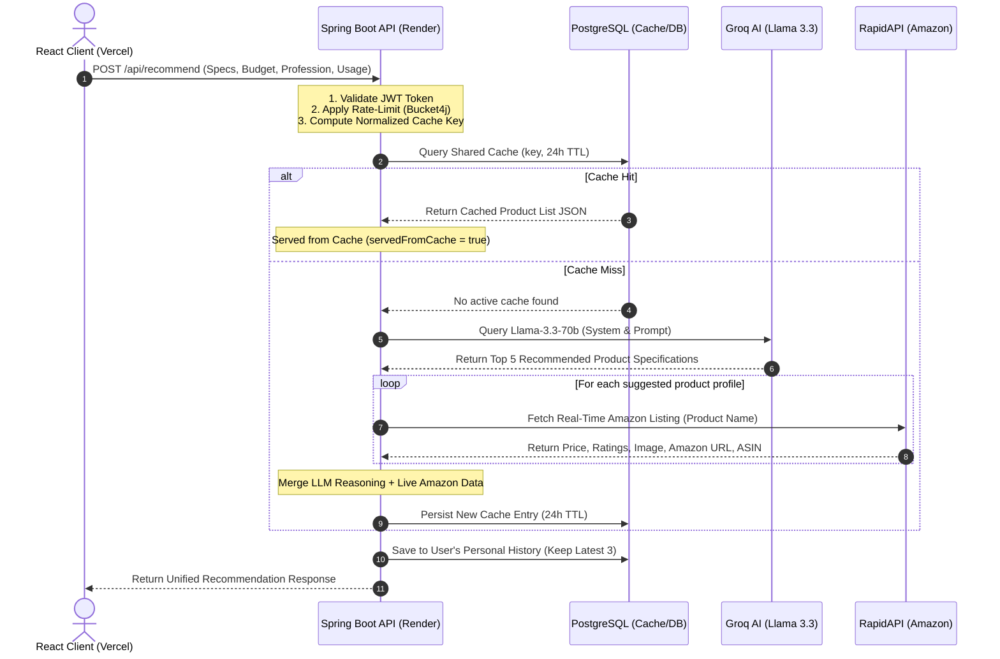
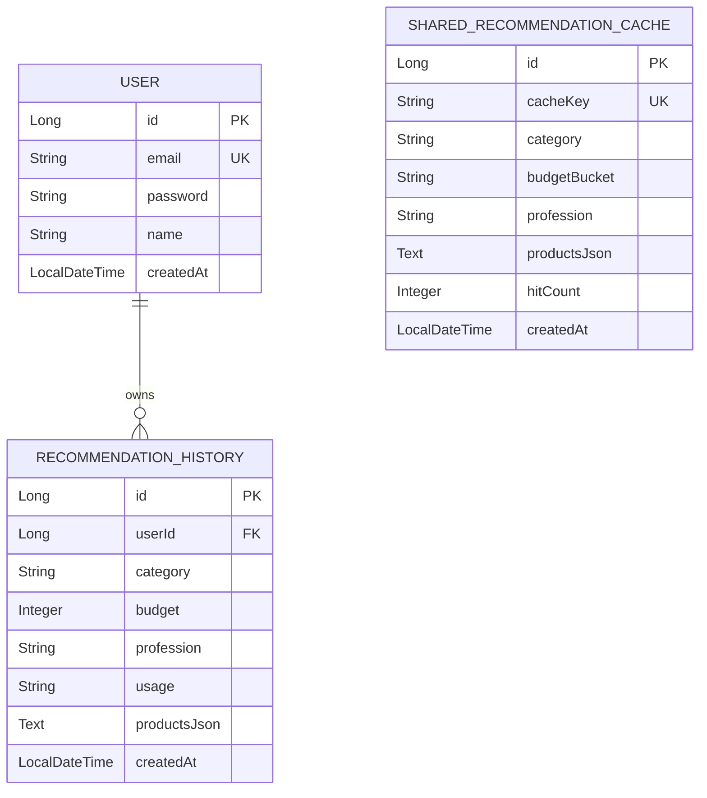

# 🔍 SmartSelect — AI-Powered Smart Buyer Assistant

SmartSelect is a modern, full-stack product recommendation engine designed for Indian consumers. It bridges the gap between static user requirements and dynamic online marketplaces by combining **Large Language Model (LLM) reasoning** with **real-time product scraping and validation**.

---

## 🚀 Key Features

*   **🧠 AI-Driven Product Profiles**: Leverages **Llama 3.3 (via Groq API)** to analyze complex profiles (user profession, budget, specific usage descriptions, and brand preferences) and formulate exact hardware suggestions.
*   **🛒 Live E-Commerce Verification**: Every AI suggestion is searched *in real-time* using the **Amazon Product Data API (RapidAPI)** to retrieve direct affiliate links, actual prices, live ratings, review counts, and product image URLs.
*   **⚡ Smart Specification Caching**: Employs a deterministic, normalized caching system. Similar user profiles (e.g. students looking for a programming laptop around ₹50,000) are served instantly from the **PostgreSQL** cache (24-hour TTL) to save API credits and speed up responses.
*   **🛡️ Multi-layered Rate Limiting**: Protects backend resources from scraping and abuse using **Bucket4j** (configured for 10 requests per user/hour).
*   **📊 User History Dashboard**: Automatically tracks and stores the 3 most recent detailed comparison histories per user.
*   **🔐 Secure Session Management**: Implements Spring Security with stateless **JWT authentication**.

---

## 🧭 System Architecture & Workflow

Here is how a recommendation request flows through the SmartSelect ecosystem:



---

## 🛠️ Technology Stack

| Layer | Technology | Key Usage |
| :--- | :--- | :--- |
| **Frontend** | React 18, TypeScript, Tailwind CSS, Vite | Responsive UI, smooth CSS transitions, interactive product grids |
| **Backend** | Spring Boot 4.x, Java 21, Maven | Core service APIs, DTO validation, integration services |
| **Security** | Spring Security, JSON Web Tokens (JWT) | Stateless auth, cors headers configuration |
| **Database** | PostgreSQL, Spring Data JPA, Hibernate | Shared cache storage, user profiles, and search histories |
| **API Clients**| RestTemplate, Jackson, Bucket4j | AI / Amazon HTTP queries, JSON mapping, token bucket rate limiting |

---

## 🗄️ Database Entities & Caching Strategy



### 🔑 Deterministic Cache Key Formula:
The shared cache computes a normalized string key:
`{category}_{budgetBucket}_{normalizedProfession}_{usageMd5Prefix}`
*   **Budget Bucketing**: Budgets are grouped into segments (e.g. `10k-15k`, `35k-50k`) so that users with similar buying capacity (e.g. ₹38k vs ₹42k) hit the same cache, maximizing speed and API budget.
*   **Usage Hashing**: The first 8 hexadecimal characters of the MD5-hashed usage details normalize query profiles.

---

## ⚡ API Payload Examples

### 📤 POST `/api/recommend` (Request)
```json
{
  "category": "laptop",
  "budget": 65000,
  "profession": "Software Engineer",
  "usage": "Needs to run heavy IDEs like IntelliJ, Docker containers, and compile Java applications smoothly. Prefer good battery life.",
  "brandPreference": "Any",
  "ram": "16GB",
  "storage": "512GB SSD",
  "processor": "Intel Core i5"
}
```

### 📥 Response (`200 OK`)
```json
{
  "products": [
    {
      "name": "ASUS Vivobook 15 Intel Core i5 13th Gen",
      "imageUrl": "https://m.media-amazon.com/images/I/71d798sdAS.jpg",
      "amazonUrl": "https://www.amazon.in/dp/B0CKD88SDA",
      "price": "₹57,990",
      "rating": "4.2",
      "reviewCount": 1420,
      "specs": ["16GB RAM", "Intel i5-1335U", "512GB SSD", "15.6-inch FHD"],
      "aiReason": "This laptop fits your engineering workflow with 16GB RAM for Docker and IDE compile cycles, staying within your budget range.",
      "brand": "Asus",
      "asin": "B0CKD88SDA",
      "fromCache": false
    }
  ],
  "category": "laptop",
  "budget": 65000,
  "profession": "Software Engineer",
  "servedFromCache": false,
  "cachedAt": null,
  "cacheAgeLabel": null,
  "generatedAt": "2026-06-11T10:35:12.450"
}
```

---

## 💻 Local Setup & Installation

### Pre-requisites:
*   Java Development Kit (JDK) 21
*   Node.js (v18+) & npm
*   PostgreSQL running locally (port 5432)

### 1. Configure Environment Variables
Copy `.env-example` to `.env` at the root directory:
```bash
cp .env-example .env
```
Fill in the database passwords, Groq AI key, and RapidAPI keys inside `.env`.

### 2. Start Services Locally
A startup script is provided at the root to load the environment variables and run both services in parallel.
Simply execute:
```bash
./start.bat
```
*   **Frontend Dev Server**: `http://localhost:5173`
*   **Backend Server**: `http://localhost:8080`

---

## 🚀 Production Deployment

Refer to the complete, production-ready guide at **[DEPLOYMENT.md](file:///c:/Users/mayan/DevloperCompleteFolder/Projects/SmartSelect/DEPLOYMENT.md)** to configure and deploy:
1.  **PostgreSQL DB** natively on Render.
2.  **Spring Boot Backend** to Render using the Docker runtime.
3.  **Vite Frontend** to Vercel with path rewrites.
